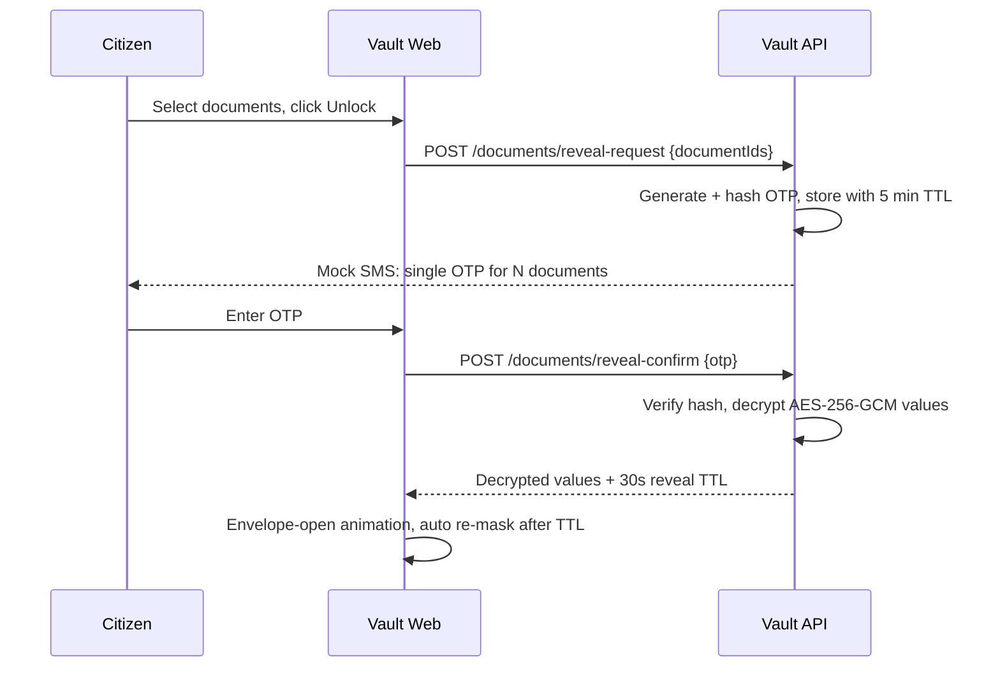
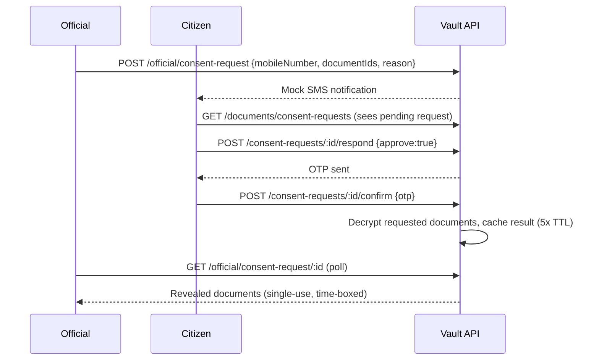

# Architecture

## Problem → Solution mapping

| Problem statement requirement | Where it's implemented |
|---|---|
| API-based exchange | Every portal (`portal-*`) exposes REST APIs; MCP servers wrap them as tools |
| Common data standards | Shared validators (`@govstack/shared/idValidators.js`) enforce consistent mobile/Aadhar/PAN formats across all services |
| Master-data management | Mobile number is the common key linking a citizen's records across Vault + all 4 portals via `/api/lookup/:mobileNumber` |
| Consent-based data sharing | Official → citizen consent-request/approve flow in `document-vault-api/src/routes.official.js` + `routes.documents.js` |
| Single sign-on / federated identity | JWT-based session issuance in the Vault API (`middleware.js`); documented path to swap in a real OIDC provider |
| Event-driven notifications | Mock SMS "gateway" (`sendMockSms`) simulates async notification delivery for OTPs & consent requests |
| Unified application tracking | Chatbot's `track_all` intent fans out to all 4 departments in parallel (`dialog.js#handleTrackAll`) |
| Configurable workflow orchestration | Chatbot's slot-filling dialog manager (`dialog.js`) drives multi-step flows (e.g. Aadhar update: field → new value → submit) |
| Reusable connectors (legacy + modern) | `packages/mcp-servers` — one MCP server per department, callable by any MCP client, not just this chatbot |
| Audit logs | `@govstack/shared/audit.js`, used by every service; viewable in the Official Console |
| Role-based access | `requireAuth(role)` middleware distinguishes `citizen` vs `official` in the Vault API |
| Data-quality checks | Input validators reject malformed mobile/Aadhar/PAN numbers at every API boundary |
| Exception handling / monitoring | `Promise.allSettled` in `track_all`; per-service `/api/health` endpoints; audit log doubles as a lightweight monitoring feed |
| Fewer duplicate submissions | Vault stores each document once; portals link by mobile number so the chatbot never asks for information twice within a session |

## High-level diagram

```mermaid
graph TD
  subgraph Citizen-facing
    VaultWeb["Document Vault Web (5173)"]
    ChatWeb["Chatbot Web - Nagrik Mitra (5174)"]
  end

  subgraph Core services
    VaultAPI["Document Vault API (4000)"]
    ChatAPI["Chatbot API (4200)<br/>NLU + Dialog Manager"]
  end

  subgraph MCP connectors (stdio, spawned by Chatbot API)
    MCPAadhar["Aadhar MCP server"]
    MCPPan["PAN MCP server"]
    MCPGas["Gas MCP server"]
    MCPElec["Electricity MCP server"]
  end

  subgraph Department portals (independent systems)
    Aadhar["Aadhar Portal (4101)"]
    Pan["PAN Portal (4102)"]
    Gas["Gas Portal (4103)"]
    Elec["Electricity Portal (4104)"]
  end

  VaultWeb <--> VaultAPI
  ChatWeb <--> ChatAPI
  ChatAPI --> MCPAadhar --> Aadhar
  ChatAPI --> MCPPan --> Pan
  ChatAPI --> MCPGas --> Gas
  ChatAPI --> MCPElec --> Elec
```

## Data flow: OTP-gated document reveal



## Data flow: consent-based official access


